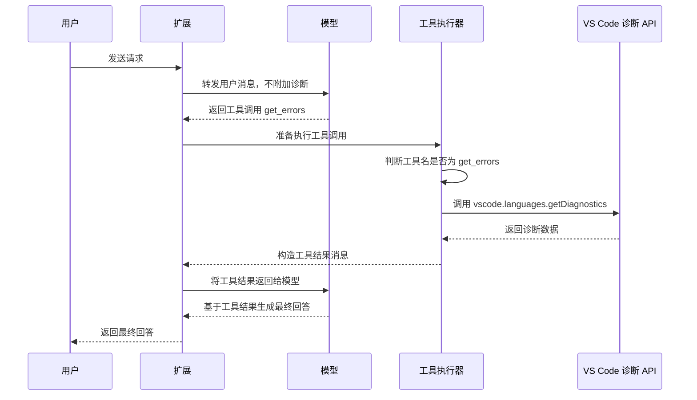

# get_errors 工具调用拦截返回方案

## 背景

当前目标不是在用户请求开始时预先注入诊断上下文，而是在模型真正发起 `get_errors` 工具调用时，由扩展拦截该工具调用，在本地通过 VS Code 诊断 API 获取问题面板数据，并把结果作为工具调用结果返回给模型。

也就是说，诊断数据只在以下条件成立时才会被收集和发送：

- 模型响应中出现工具调用；
- 工具名称为 `get_errors`；
- 工具执行器准备执行该工具调用。

对于没有调用 `get_errors` 的普通请求，不附加诊断上下文，不主动读取诊断，也不改变原始消息。

## 核心原则

1. 不在请求启动阶段注入诊断。
2. 不通过关键词判断用户是否可能需要错误信息。
3. 只在模型明确调用 `get_errors` 时处理。
4. 对模型来说，返回结果应表现得像一次正常工具调用结果。
5. 对其他工具调用保持原有流程，不做特殊处理。

## 调整后的流程



## 一、如何拦截模型对 get_errors 的工具调用

拦截点应放在“工具执行器”或“工具分发器”中，而不是放在用户请求入口。

通常扩展里的模型调用链路会类似这样：

```ts
async function handleUserRequest(userText: string) {
  const firstResponse = await sendMessagesToModel([
    { role: 'user', content: userText }
  ]);

  if (firstResponse.toolCalls?.length) {
    const toolResults = await executeToolCalls(firstResponse.toolCalls);

    const finalResponse = await sendMessagesToModel([
      { role: 'user', content: userText },
      firstResponse.message,
      ...toolResults
    ]);

    return finalResponse;
  }

  return firstResponse;
}
```

新的逻辑只需要改 `executeToolCalls`：

```ts
async function executeToolCalls(toolCalls: ToolCall[]): Promise<ToolResultMessage[]> {
  const results: ToolResultMessage[] = [];

  for (const toolCall of toolCalls) {
    if (toolCall.name === 'get_errors') {
      results.push(await executeGetErrorsLocally(toolCall));
      continue;
    }

    results.push(await executeNormalTool(toolCall));
  }

  return results;
}
```

这样可以确保：

- 用户刚发请求时不附加诊断；
- 模型不调用 `get_errors` 时不获取诊断；
- 只有模型调用 `get_errors` 时才走本地诊断读取逻辑。

## 二、工具拦截后的数据获取和返回流程

### 输入参数设计

为了兼容原有 `get_errors` 工具，可以支持类似参数：

```ts
interface GetErrorsArguments {
  filePaths?: string[];
}
```

含义：

- `filePaths` 为空或未提供：返回当前所有可见诊断；
- `filePaths` 有值：只返回指定文件或目录下的诊断。

### 返回结构设计

建议工具结果保持结构化，同时可附带文本摘要：

```ts
interface GetErrorsToolResult {
  ok: boolean;
  summary: {
    total: number;
    error: number;
    warning: number;
    information: number;
    hint: number;
  };
  diagnostics: DiagnosticPayload[];
  message: string;
  truncated: boolean;
}
```

其中 `diagnostics` 是模型可直接理解的诊断列表。

## 三、核心代码示例

### 类型定义

```ts
import * as vscode from 'vscode';

interface ToolCall {
  id: string;
  name: string;
  arguments?: unknown;
}

interface ToolResultMessage {
  role: 'tool';
  tool_call_id: string;
  name?: string;
  content: string;
}

interface GetErrorsArguments {
  filePaths?: string[];
}

interface DiagnosticPayload {
  uri: string;
  filePath: string;
  severity: 'error' | 'warning' | 'information' | 'hint' | 'unknown';
  message: string;
  source?: string;
  code?: string;
  range: {
    startLine: number;
    startCharacter: number;
    endLine: number;
    endCharacter: number;
  };
}

interface GetErrorsToolResult {
  ok: boolean;
  summary: {
    total: number;
    error: number;
    warning: number;
    information: number;
    hint: number;
  };
  diagnostics: DiagnosticPayload[];
  message: string;
  truncated: boolean;
}
```

### 工具调用分发器

```ts
async function executeToolCalls(toolCalls: ToolCall[]): Promise<ToolResultMessage[]> {
  const results: ToolResultMessage[] = [];

  for (const toolCall of toolCalls) {
    if (toolCall.name === 'get_errors') {
      results.push(await executeGetErrorsLocally(toolCall));
      continue;
    }

    results.push(await executeNormalTool(toolCall));
  }

  return results;
}
```

### 本地执行 get_errors

```ts
async function executeGetErrorsLocally(toolCall: ToolCall): Promise<ToolResultMessage> {
  try {
    const args = parseGetErrorsArguments(toolCall.arguments);

    const result = await withTimeout(
      Promise.resolve(collectDiagnostics(args)),
      3000,
      '获取 VS Code 诊断信息超时'
    );

    return {
      role: 'tool',
      tool_call_id: toolCall.id,
      name: toolCall.name,
      content: JSON.stringify(result, null, 2)
    };
  } catch (error) {
    const result: GetErrorsToolResult = {
      ok: false,
      summary: {
        total: 0,
        error: 0,
        warning: 0,
        information: 0,
        hint: 0
      },
      diagnostics: [],
      message: error instanceof Error ? error.message : '获取诊断信息失败',
      truncated: false
    };

    return {
      role: 'tool',
      tool_call_id: toolCall.id,
      name: toolCall.name,
      content: JSON.stringify(result, null, 2)
    };
  }
}
```

### 参数解析

```ts
function parseGetErrorsArguments(raw: unknown): GetErrorsArguments {
  if (!raw) {
    return {};
  }

  if (typeof raw === 'string') {
    try {
      const parsed = JSON.parse(raw) as GetErrorsArguments;
      return normalizeGetErrorsArguments(parsed);
    } catch {
      return {};
    }
  }

  return normalizeGetErrorsArguments(raw as GetErrorsArguments);
}

function normalizeGetErrorsArguments(args: GetErrorsArguments): GetErrorsArguments {
  return {
    filePaths: Array.isArray(args.filePaths)
      ? args.filePaths.filter(item => typeof item === 'string' && item.trim().length > 0)
      : undefined
  };
}
```

### 收集诊断

```ts
function collectDiagnostics(args: GetErrorsArguments): GetErrorsToolResult {
  const all = vscode.languages.getDiagnostics();
  const maxItems = 200;

  const diagnostics: DiagnosticPayload[] = [];

  for (const [uri, items] of all) {
    if (!matchesRequestedPaths(uri, args.filePaths)) {
      continue;
    }

    for (const item of items) {
      diagnostics.push(toDiagnosticPayload(uri, item));
    }
  }

  diagnostics.sort(compareDiagnostics);

  const truncated = diagnostics.length > maxItems;
  const visibleDiagnostics = diagnostics.slice(0, maxItems);
  const summary = buildSummary(diagnostics);

  return {
    ok: true,
    summary,
    diagnostics: visibleDiagnostics,
    message: diagnostics.length === 0
      ? '当前没有匹配的 VS Code 诊断信息。'
      : truncated
        ? `已获取 ${diagnostics.length} 条诊断，返回前 ${maxItems} 条。`
        : `已获取 ${diagnostics.length} 条诊断。`,
    truncated
  };
}
```

### 路径筛选

```ts
function matchesRequestedPaths(uri: vscode.Uri, filePaths?: string[]): boolean {
  if (!filePaths?.length) {
    return true;
  }

  const fullPath = uri.fsPath || uri.toString();
  const relativePath = vscode.workspace.asRelativePath(uri, false);

  return filePaths.some(requestedPath => {
    const normalized = requestedPath.replace(/\\/g, '/');
    const normalizedFullPath = fullPath.replace(/\\/g, '/');
    const normalizedRelativePath = relativePath.replace(/\\/g, '/');

    return normalizedFullPath.includes(normalized)
      || normalizedRelativePath.includes(normalized);
  });
}
```

### 诊断转换

```ts
function toDiagnosticPayload(
  uri: vscode.Uri,
  diagnostic: vscode.Diagnostic
): DiagnosticPayload {
  return {
    uri: uri.toString(),
    filePath: uri.fsPath || uri.toString(),
    severity: toSeverityText(diagnostic.severity),
    message: diagnostic.message,
    source: diagnostic.source,
    code: normalizeCode(diagnostic.code),
    range: {
      startLine: diagnostic.range.start.line + 1,
      startCharacter: diagnostic.range.start.character + 1,
      endLine: diagnostic.range.end.line + 1,
      endCharacter: diagnostic.range.end.character + 1
    }
  };
}

function toSeverityText(severity: vscode.DiagnosticSeverity): DiagnosticPayload['severity'] {
  switch (severity) {
    case vscode.DiagnosticSeverity.Error:
      return 'error';
    case vscode.DiagnosticSeverity.Warning:
      return 'warning';
    case vscode.DiagnosticSeverity.Information:
      return 'information';
    case vscode.DiagnosticSeverity.Hint:
      return 'hint';
    default:
      return 'unknown';
  }
}

function normalizeCode(code: vscode.Diagnostic['code']): string | undefined {
  if (code === undefined) {
    return undefined;
  }

  if (typeof code === 'string' || typeof code === 'number') {
    return String(code);
  }

  return String(code.value);
}
```

### 统计与排序

```ts
function buildSummary(diagnostics: DiagnosticPayload[]): GetErrorsToolResult['summary'] {
  const summary = {
    total: diagnostics.length,
    error: 0,
    warning: 0,
    information: 0,
    hint: 0
  };

  for (const item of diagnostics) {
    if (item.severity === 'error') {
      summary.error += 1;
    } else if (item.severity === 'warning') {
      summary.warning += 1;
    } else if (item.severity === 'information') {
      summary.information += 1;
    } else if (item.severity === 'hint') {
      summary.hint += 1;
    }
  }

  return summary;
}

function compareDiagnostics(a: DiagnosticPayload, b: DiagnosticPayload): number {
  const weight: Record<DiagnosticPayload['severity'], number> = {
    error: 1,
    warning: 2,
    information: 3,
    hint: 4,
    unknown: 5
  };

  const severityDiff = weight[a.severity] - weight[b.severity];
  if (severityDiff !== 0) {
    return severityDiff;
  }

  const fileDiff = a.filePath.localeCompare(b.filePath);
  if (fileDiff !== 0) {
    return fileDiff;
  }

  return a.range.startLine - b.range.startLine;
}
```

### 超时处理

```ts
function withTimeout<T>(promise: Promise<T>, timeoutMs: number, message: string): Promise<T> {
  return new Promise<T>((resolve, reject) => {
    const timer = setTimeout(() => {
      reject(new Error(message));
    }, timeoutMs);

    promise.then(
      value => {
        clearTimeout(timer);
        resolve(value);
      },
      error => {
        clearTimeout(timer);
        reject(error);
      }
    );
  });
}
```

### 普通工具保持原逻辑

```ts
async function executeNormalTool(toolCall: ToolCall): Promise<ToolResultMessage> {
  // 这里保留原来的工具执行逻辑。
  throw new Error(`未实现的工具：${toolCall.name}`);
}
```

## 四、兼容现有工具调用协议

关键点是返回消息必须与当前模型协议中的工具结果格式一致。

如果当前使用的是 OpenAI 兼容协议，工具返回通常类似：

```ts
{
  role: 'tool',
  tool_call_id: toolCall.id,
  content: JSON.stringify(result)
}
```

如果当前内部协议还需要工具名，可以额外保留：

```ts
{
  role: 'tool',
  tool_call_id: toolCall.id,
  name: 'get_errors',
  content: JSON.stringify(result)
}
```

模型并不知道结果来自真实外部工具还是扩展本地拦截。对模型来说，它只是收到了一条 `get_errors` 的工具执行结果。

## 五、不涉及 get_errors 的请求如何处理

普通请求流程保持不变：

```ts
async function handleUserRequestWithoutInitialDiagnostics(userText: string) {
  const messages = [
    { role: 'user' as const, content: userText }
  ];

  const response = await sendMessagesToModel(messages);

  if (!response.toolCalls?.length) {
    return response;
  }

  const toolResults = await executeToolCalls(response.toolCalls);

  return sendMessagesToModel([
    ...messages,
    response.message,
    ...toolResults
  ]);
}
```

这里没有任何初始诊断注入逻辑。

## 六、边界情况

### 无诊断

仍然返回成功结果：

```json
{
  "ok": true,
  "summary": {
    "total": 0,
    "error": 0,
    "warning": 0,
    "information": 0,
    "hint": 0
  },
  "diagnostics": [],
  "message": "当前没有匹配的 VS Code 诊断信息。",
  "truncated": false
}
```

这样模型可以明确知道工具执行成功，只是没有问题。

### 工作区未打开

`vscode.languages.getDiagnostics()` 仍可能返回已打开文件的诊断。不要直接报错，可以正常返回，同时在 `message` 中说明：

```ts
const hasWorkspace = !!vscode.workspace.workspaceFolders?.length;
```

如果需要，可以把提示拼入返回消息。

### 诊断来源不可用

某些语言服务、检查器或扩展尚未启动时，诊断可能为空。这不是工具执行失败，应返回空结果。

### 诊断数量过多

需要截断，避免工具结果过大。建议默认最多返回 200 条，并设置 `truncated: true`。

### 参数异常

参数异常不应导致整个会话中断。可以降级为获取所有诊断，或者返回 `ok: false`。推荐对无法解析的参数降级为空参数。

### 虚拟文件

对于 `untitled`、`vscode-notebook-cell`、远程文件等 URI，`fsPath` 可能不可靠，因此要保留 `uri.toString()`。

## 七、关键改动说明

原方案：

- 在用户请求入口判断是否与错误相关；
- 如果相关，立即读取诊断；
- 把诊断作为系统消息或上下文注入给模型。

新方案：

- 用户请求入口不判断错误意图；
- 用户请求入口不读取诊断；
- 模型先正常决定是否调用工具；
- 只有当工具名为 `get_errors` 时，工具执行器才拦截；
- 拦截后本地调用 `vscode.languages.getDiagnostics()`；
- 将结果封装成工具返回消息发回模型；
- 其他工具调用保持原逻辑。

## 八、推荐落点

建议把该能力放在现有工具执行模块或请求循环中，例如：

- `toolRunner.ts`
- `provider.ts` 中处理模型工具调用的位置
- `extension.ts` 中命令处理之后、模型二次请求之前的位置

不要放在：

- 扩展启动 `activate` 阶段；
- 用户消息构造阶段；
- 提示词增强阶段；
- 通用上下文缓存阶段。

## 总结

该方案把 `get_errors` 设计为“模型显式调用时才执行的本地虚拟工具”。扩展不再提前注入诊断上下文，而是在工具调用返回阶段伪装成正常工具结果，把 VS Code 问题面板中的诊断数据返回给模型。这样既满足按需获取，又能保持与现有工具调用协议兼容，并避免无关请求携带额外诊断上下文。
